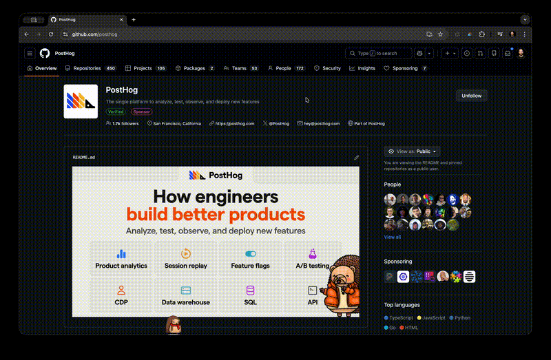

# Hedgehog Mode Anywhere 🦔

Bring [PostHog](https://posthog.com)'s beloved hedgehog mascot to any website! An adorable animated companion that walks, jumps, and keeps you company while you browse.

Powered by PostHog's official [`@posthog/hedgehog-mode`](https://github.com/PostHog/hedgehog-mode) engine, with pixi.js rendering and matter-js physics.



## ✨ Features

- 🚶 Animated hedgehog with multiple animations (walk, jump, wave, and more)
- 🎯 Physics-based movement with gravity and bouncing
- 🧱 Lands on and walks across page elements (buttons, inputs, navbars)
- 🖱️ Drag and throw with your mouse
- ⌨️ Keyboard controls (WASD / arrow keys)
- 🎭 5 skins: Default, Spiderhog, Robohog, Hogzilla, Ghost
- 🎨 10 color variations
- 👒 16 accessories across headwear, eyewear, and other categories
- 🥚 Secret codes and easter eggs

## 🛠️ Build

This extension lives in the [`hedgehog-mode`](https://github.com/PostHog/hedgehog-mode) monorepo and bundles the local [`@posthog/hedgehog-mode`](https://github.com/PostHog/hedgehog-mode) engine (wired up as `workspace:*`), so the two are built and tested together. Build from the repo root:

```bash
pnpm install
pnpm build       # builds the engine, the playground, then this extension
```

Or build just the extension — the engine's `dist/` has to exist first, which `pnpm build` or `pnpm dev` at the root produces:

```bash
pnpm --dir hedgehog-mode-anywhere build
```

This produces `dist/content.js`, `dist/popup.js`, and copies the hedgehog spritesheet into `assets/`. Use `pnpm --dir hedgehog-mode-anywhere watch` to rebuild on change while developing.

> The bundled `@posthog/hedgehog-mode` must keep pixi.js externalized ([PostHog/hedgehog-mode#30](https://github.com/PostHog/hedgehog-mode/pull/30)). Builds that inline pixi.js use a `new Function` shader path that MV3 content scripts forbid and that the extension can't patch. With pixi external, `src/content.jsx` patches the single shared pixi.js for eval-free shaders and main-thread texture loading, so the hedgehog runs on any page even under a strict Content-Security-Policy.

## 📦 Installation

### Chrome / Brave / Edge (Chromium browsers)

1. Clone the monorepo and run the build step above
2. Open your browser and navigate to `chrome://extensions/` (or `brave://extensions/`, `edge://extensions/`)
3. Enable "Developer mode" using the toggle in the top-right corner
4. Click "Load unpacked"
5. Select the `hedgehog-mode-anywhere/` folder
6. The hedgehog icon should appear in your browser toolbar

## 🚀 Usage

1. Click the hedgehog icon in your toolbar to open the settings popup
2. Toggle "Enabled hedgehog mode" to add a hedgehog to the current page
3. Customize your hedgehog with different skins, colors, and accessories

### 🎮 Controls

| Input | Action |
| --- | --- |
| Arrow keys / WASD | Move left/right |
| Space / W / Up | Jump (hold for height) |
| Down / S | Drop through platforms |
| Shift + direction | Run 🏃 |
| Alt + direction | Moonwalk 🕺 |
| Hold F | 🔥 Breathe fire |
| Click (as Spiderhog) | 🕸️ Sling a web — hold and press W / S to climb |
| Click and drag | Pick up and throw |

### 🤫 Secret Codes

Type these while on a page with the hedgehog:

| Code | Effect |
| --- | --- |
| `fff` or `fire` | 🔥 Sets the hedgehog on fire |
| `spiderhog` / `robohog` / `ghost` | 🕷️🤖👻 Change skin |
| `rainbow` | 🌈 Rainbow color |
| `spawn` or `hedgehog` | 🦔 Spawn a friend |
| `chaos` | 🦔🦔🦔 Spawn ten friends |
| `hello` | 👋 Wave |
| `giant` / `tiny` | Resize the hedgehog |
| `slow` / `fast` | Change game speed |
| `cheatcodes` | 📜 Show the full cheat sheet |
| `death` | ☠️ Clear all hedgehogs |
| ↑↑↓↓←→←→BA | 🚀 Konami code |

## ⚙️ Options

- **Walk around freely** - Let the hedgehog roam on its own
- **Interact with elements** - Land on buttons, inputs, and other page elements
- **Keyboard controls** - Enable WASD / arrow key movement

## Credits

Built with ❤️ by [PostHog](https://posthog.com), powered by the [`@posthog/hedgehog-mode`](https://github.com/PostHog/hedgehog-mode) engine that drives the hedgehog in the PostHog app.
